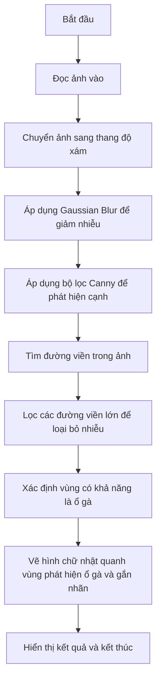

# Pothole Detection using Python
<a href="https://www.facebook.com/duytan.hh">Facebook</a>
<a href="https://t.me/duytan2003">Telegram</a>

## Phát hiện ổ gà bằng xử lí hình ảnh 
Mô tả: Sử dụng thuật toán phát hiện đường viền(Edge Detection) và bộ lọc Canny để nhận dạng ổ gà và đưa ra cảnh báo cho tài xế
## Sơ đồ khối

## Bộ lọc Canny
# Bộ Lọc Canny (Canny Edge Detector)

Bộ lọc Canny là một quy trình phát hiện cạnh tiên tiến và phức tạp, trong đó có sự kết hợp của nhiều khía cạnh toán học nhằm phát hiện và làm nổi bật các cạnh trong ảnh. Các bước chính của thuật toán này bao gồm nhiều phép toán như tính gradient, làm trơn ảnh, non-maximum suppression, và ngưỡng kép (hysteresis thresholding). Dưới đây là cách diễn giải chi tiết về mặt toán học của từng bước trong bộ lọc Canny:

## 1. Làm mờ ảnh bằng Gaussian Blur
Làm mờ ảnh là bước đầu tiên nhằm giảm nhiễu trong ảnh, được thực hiện bằng cách áp dụng bộ lọc Gaussian. Bộ lọc này giúp loại bỏ các chi tiết nhỏ và nhiễu mà không làm mất các cạnh lớn.

- Công thức của Gaussian kernel \( G(x, y) \) trong không gian 2D:
  \[
  G(x, y) = \frac{1}{2\pi\sigma^2} e^{-\frac{x^2 + y^2}{2\sigma^2}}
  \]
  trong đó \( \sigma \) là độ lệch chuẩn của Gaussian và xác định độ rộng của bộ lọc.

- Khi áp dụng bộ lọc Gaussian vào một ảnh \( I(x, y) \), mỗi pixel \( I(x, y) \) được thay thế bởi giá trị trung bình có trọng số của các pixel lân cận trong vùng lân cận Gaussian. Công thức làm mờ:
  \[
  I_{\text{blurred}}(x, y) = \sum_{u=-k}^{k} \sum_{v=-k}^{k} G(u, v) \cdot I(x-u, y-v)
  \]
  trong đó \( k \) phụ thuộc vào kích thước của bộ lọc Gaussian.

## 2. Tính toán Gradient để phát hiện cạnh
Sau khi làm mờ ảnh, thuật toán tính gradient của ảnh để tìm các khu vực có sự thay đổi mạnh về cường độ điểm ảnh, vốn thường là các cạnh.

- Gradient theo hai hướng \( x \) và \( y \) được tính bằng cách sử dụng bộ lọc Sobel:
  \[
  G_x = \begin{bmatrix} -1 & 0 & 1 \\ -2 & 0 & 2 \\ -1 & 0 & 1 \end{bmatrix} * I
  \]
  \[
  G_y = \begin{bmatrix} -1 & -2 & -1 \\ 0 & 0 & 0 \\ 1 & 2 & 1 \end{bmatrix} * I
  \]
  trong đó \( G_x \) và \( G_y \) là gradient theo hướng \( x \) và \( y \) của ảnh \( I \), và \( * \) biểu diễn phép tích chập.

- Độ lớn và hướng của gradient:
  - Độ lớn gradient \( G \) được tính bằng:
    \[
    G = \sqrt{G_x^2 + G_y^2}
    \]
  - Hướng gradient \( \theta \):
    \[
    \theta = \arctan\left(\frac{G_y}{G_x}\right)
    \]
  Độ lớn của gradient cho biết độ mạnh của cạnh, và hướng gradient cho biết hướng của cạnh trong không gian ảnh.

## 3. Non-maximum Suppression (Loại bỏ cực đại không cần thiết)
Non-maximum Suppression giúp làm mỏng các cạnh bằng cách giữ lại những điểm là cực đại cục bộ theo hướng của gradient và loại bỏ các điểm khác.

- Đối với mỗi pixel \( (x, y) \) có độ lớn gradient \( G(x, y) \) và hướng gradient \( \theta \), chúng ta sẽ so sánh giá trị của pixel với hai điểm lân cận theo hướng của gradient:
  - Nếu \( G(x, y) \) không phải là cực đại trong hướng của gradient, giá trị của nó được đặt bằng 0 (loại bỏ).
  - Nếu là cực đại, giữ nguyên giá trị.

## 4. Ngưỡng kép (Hysteresis Thresholding)
Ngưỡng kép là bước cuối cùng để xác định các cạnh mạnh và loại bỏ các điểm nhiễu yếu không liên kết.

- Sử dụng hai ngưỡng: 
  - **Ngưỡng cao** \( T_{\text{high}} \): Các pixel có độ lớn gradient \( G(x, y) \) lớn hơn ngưỡng cao được coi là cạnh mạnh và được giữ lại.
  - **Ngưỡng thấp** \( T_{\text{low}} \): Các pixel có độ lớn gradient nằm giữa ngưỡng cao và ngưỡng thấp được coi là cạnh yếu. Các pixel cạnh yếu chỉ được giữ lại nếu chúng nằm gần các pixel cạnh mạnh, giúp đảm bảo tính liên tục của cạnh.

## Toán học của Hysteresis Thresholding:
Giả sử \( T_{\text{high}} = 100 \) và \( T_{\text{low}} = 50 \):
- **Giữ** các pixel có độ lớn gradient \( G(x, y) > T_{\text{high}} \).
- Các pixel \( T_{\text{low}} < G(x, y) < T_{\text{high}} \) chỉ được giữ nếu chúng nằm kề với một pixel có giá trị \( G(x, y) > T_{\text{high}} \).
- Các pixel còn lại bị loại bỏ (đặt về 0).

## Mô tả thuật toán tổng quan của bộ lọc Canny

Bộ lọc Canny có thể được tổng kết lại như sau:
1. Làm mờ ảnh bằng Gaussian để loại bỏ nhiễu.
2. Tính gradient theo hướng x và y, từ đó tính độ lớn và hướng gradient để phát hiện cạnh.
3. Áp dụng non-maximum suppression để làm mỏng cạnh.
4. Dùng ngưỡng kép để xác định cạnh mạnh và cạnh yếu, và áp dụng ngưỡng hysteresis để nối các cạnh yếu nằm gần cạnh mạnh.

## Mã Canny trong OpenCV
```python
import cv2

# Đọc ảnh
image = cv2.imread('example.jpg', cv2.IMREAD_GRAYSCALE)

# Áp dụng bộ lọc Canny
edges = cv2.Canny(image, 100, 200)

# Hiển thị kết quả
cv2.imshow("Canny Edge Detection", edges)
cv2.waitKey(0)
cv2.destroyAllWindows()

## Phương pháp phát hiện đường viền ( Edge Detection )
Phát hiện cạnh (edge detection) là một trong những kỹ thuật cơ bản và quan trọng trong xử lý ảnh, giúp xác định và làm nổi bật các ranh giới (cạnh) trong ảnh, nơi có sự thay đổi lớn về cường độ màu sắc hoặc độ sáng. Phát hiện cạnh giúp trích xuất các đặc điểm chính của đối tượng trong ảnh, hỗ trợ cho các ứng dụng như nhận diện đối tượng, phát hiện biên dạng, và phân tích ảnh.
