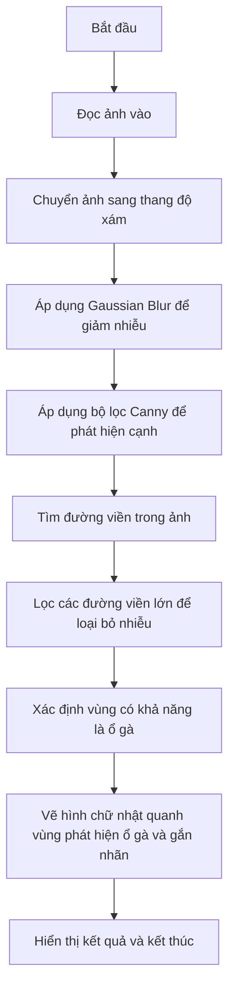

# Pothole Detection using Python (Non-AI)
<p align="center">
<a href="https://www.python.org/" target="_blank"></a>
<a href="https://opencv.org/" target="_blank"></a>
<a href="https://code.visualstudio.com/" target="_blank"></a>
</p>
<p align="center">
<a href="https://twitter.com/12dtan" target="_blank"></a>
<a href="https://fb.com/duytan.hh" target="_blank"></a>
<a href="https://t.me/duytan2003" target="_blank"></a>
<a href="https://www.linkedin.com/in/l%C3%AA-tr%E1%BA%A7n-duy-t%C3%A2n-81112a23a/" target="_blank"></a>
<a href="https://instagram/duytan.hh" target="_blank"></a>
</p>

## Phát hiện ổ gà bằng xử lí hình ảnh 
Mô tả: Sử dụng thuật toán phát hiện đường viền (Edge Detection) và bộ lọc Canny để nhận dạng ổ gà và đưa ra cảnh báo cho tài xế
<p align="center">
  


## I. Sơ đồ khối

## II. Thuật toán phát hiện cạnh ( Edge Detection )
Phát hiện cạnh (edge detection) là một trong những kỹ thuật cơ bản và quan trọng trong xử lý ảnh, giúp xác định và làm nổi bật các ranh giới (cạnh) trong ảnh, nơi có sự thay đổi lớn về cường độ màu sắc hoặc độ sáng. Phát hiện cạnh giúp trích xuất các đặc điểm chính của đối tượng trong ảnh, hỗ trợ cho các ứng dụng như nhận diện đối tượng, phát hiện biên dạng, và phân tích ảnh.

Các đường viền (biên) thường được xác định ở các vùng mà màu sắc hoặc độ sáng thay đổi mạnh, ví dụ như ranh giới giữa các vật thể hoặc giữa một vật thể và nền của nó. Phát hiện đường viền là một bước quan trọng trong nhiều ứng dụng, chẳng hạn như:

- Nhận dạng đối tượng (Object detection).
- Nhận dạng và phân tích hình dạng (Shape analysis).
- Theo dõi đối tượng (Object tracking).
- Phân đoạn ảnh (Image segmentation).

### Các phương pháp phát hiện đường viền phổ biến

#### 1. Bộ lọc Canny
- Phát hiện biên Canny là một trong những thuật toán phổ biến nhất và mạnh mẽ nhất, với các bước xử lý để làm mịn ảnh, tính gradient, làm mỏng biên, và áp dụng ngưỡng kép.
- Kết quả của bộ lọc Canny thường rõ ràng, giúp xác định các đường viền chi tiết trong ảnh.

#### 2. Phép tính Gradient (Sobel, Prewitt, Roberts)
- Các toán tử này sử dụng phép tính gradient để xác định các vùng có sự thay đổi lớn về độ sáng, tức là các biên.
- **Sobel** và **Prewitt** tính toán độ dốc theo hai hướng (ngang và dọc) để xác định các biên trong ảnh.
- **Roberts** thực hiện tính toán gradient theo hướng chéo.

#### 3. Laplacian và Laplacian of Gaussian (LoG)
- Toán tử **Laplacian** xác định các vùng có sự thay đổi cường độ lớn bằng cách tính toán độ biến thiên bậc hai của ảnh.
- **Laplacian of Gaussian (LoG)** là sự kết hợp của bộ lọc Gaussian để làm mờ nhiễu và toán tử Laplacian để phát hiện biên.

#### 4. Phép toán hình thái học (Morphological operations)
- Các phép toán hình thái học như giãn nở (dilation), xói mòn (erosion), và đóng/mở (closing/opening) có thể giúp làm nổi bật các đường viền trong ảnh nhị phân hoặc các đối tượng đã được phân đoạn.

#### 5. Hough Transform
- **Hough Transform** là phương pháp dựa trên lý thuyết bỏ phiếu, thường được dùng để phát hiện các đường thẳng hoặc hình tròn trong ảnh.

#### 6. Phép biến đổi Watershed
- **Watershed** là một phương pháp phân đoạn dựa trên sự phân tách địa hình, giúp xác định các đối tượng dính liền nhau.

## III. Bộ lọc Canny
Bộ lọc Canny đóng vai trò là một phương pháp phát hiện biên để xác định các đường viền của các đối tượng trong ảnh. Canny là một trong các phương pháp phát hiện biên phổ biến và mạnh mẽ, giúp loại bỏ các chi tiết không quan trọng và làm nổi bật các biên rõ ràng
### Nguyên lý làm việc của bộ lọc Canny
#### Làm mờ Gaussian

Để giảm nhiễu và chi tiết trong ảnh, một bộ lọc Gaussian được áp dụng. Làm mờ Gaussian làm mịn ảnh bằng cách tích chập ảnh với một bộ lọc Gaussian.

##### Công thức:
Với ảnh \( I \) và bộ lọc Gaussian \( G \):

Công thức tính làm mờ Gaussian:

$$
I_{blurred}(x, y) = \sum_{u=-k}^{k} \sum_{v=-k}^{k} G(u, v) \cdot I(x - u, y - v)
$$

trong đó:
- \( k \) là kích thước của bộ lọc,
- \( G(u, v) \) là hàm Gaussian:

$$
G(x, y) = \frac{1}{2 \pi \sigma^2} e^{-\frac{x^2 + y^2}{2 \sigma^2}}
$$

#### Tính toán Gradient

Bước tiếp theo là tính gradient cường độ của ảnh. Điều này có thể thực hiện bằng cách áp dụng các bộ lọc Sobel để xấp xỉ gradient theo hướng \( x \) và \( y \).

##### Công thức:
Với ảnh \( I \), gradient \( G_x \) và \( G_y \) được tính như sau:

$$
G_x = \frac{\partial I}{\partial x} \quad \text{và} \quad G_y = \frac{\partial I}{\partial y}
$$

Độ lớn gradient \( G \) và hướng \( \theta \) được tính:

$$
G = \sqrt{G_x^2 + G_y^2}
$$

$$
\theta = \arctan \left( \frac{G_y}{G_x} \right)
$$

#### Loại bỏ tối đa không phải biên (Non-Maximum Suppression)

Để làm mỏng các biên, thuật toán loại bỏ các giá trị gradient không phải là cực đại. Đối với mỗi pixel, nếu giá trị gradient của nó không phải là cực đại theo hướng gradient, giá trị đó sẽ được đặt thành 0.

#### Ngưỡng kép (Double Thresholding)

Sau khi làm mỏng, một ngưỡng kép được áp dụng để xác định các biên tiềm năng. Hai ngưỡng cao và thấp được chọn để phân loại pixel thành mạnh, yếu hoặc không liên quan.

#### Theo dõi biên bằng ngưỡng (Edge Tracking by Hysteresis)

Cuối cùng, theo dõi biên được thực hiện để kết nối các biên yếu với các biên mạnh, giúp đảm bảo các biên liên tục và kết nối tốt.


## IV. Mã nguồn 

### **Đọc và chuyển ảnh thành ảnh xám (Grayscale)**
```python
im = cv2.imread('611.jpg')
gray1 = cv2.cvtColor(im, cv2.COLOR_BGR2GRAY)
cv2.imwrite('graypothholeresult.jpg', gray1)
```
- **cv2.imread('611.jpg')**: Đọc ảnh từ file `611.jpg`.
- **cv2.cvtColor(im, cv2.COLOR_BGR2GRAY)**: Chuyển ảnh màu BGR thành ảnh xám (grayscale) để giảm độ phức tạp trong xử lý.
- **cv2.imwrite('graypothholeresult.jpg', gray1)**: Lưu ảnh xám vào file `graypothholeresult.jpg`.

### **Phát hiện đường biên (Contours)**
```python
imgray = cv2.cvtColor(im, cv2.COLOR_BGR2GRAY)
ret, thresh = cv2.threshold(imgray, 127, 255, 0)
contours2, _ = cv2.findContours(thresh, cv2.RETR_TREE, cv2.CHAIN_APPROX_SIMPLE)
out = cv2.drawContours(im.copy(), contours2, -1, (250, 250, 250), 1)
```
- **cv2.cvtColor(im, cv2.COLOR_BGR2GRAY)**: Chuyển ảnh gốc thành ảnh xám (một lần nữa, có thể dư thừa ở đây).
- **cv2.threshold(imgray, 127, 255, 0)**: Áp dụng phép threshold, chuyển ảnh xám thành ảnh nhị phân (black and white), giá trị pixel lớn hơn 127 sẽ được đặt thành 255 (trắng), các pixel còn lại sẽ thành 0 (đen).
- **cv2.findContours(thresh, cv2.RETR_TREE, cv2.CHAIN_APPROX_SIMPLE)**: Tìm các đường biên (contours) trong ảnh nhị phân.
- **cv2.drawContours(im.copy(), contours2, -1, (250, 250, 250), 1)**: Vẽ các đường biên lên ảnh sao chép `im` với màu trắng `(250, 250, 250)` và độ dày đường biên là 1.

### **Vẽ hình chữ nhật bao quanh các đối tượng**
```python
for c in contours:
    rect = cv2.boundingRect(c)
    if rect[2] < 100 or rect[3] < 100: continue
    x, y, w, h = rect
    cv2.rectangle(im, (x, y), (x + w, y + h), (0, 255, 0), 8)
    cv2.putText(im, 'Moth Detected', (x + w + 40, y + h), 0, 2.0, (0, 255, 0))
```
- Duyệt qua tất cả các đường biên (`contours`) để vẽ hình chữ nhật bao quanh các đối tượng.
- **cv2.boundingRect(c)**: Tính toán hình chữ nhật bao quanh đối tượng (contour).
- **cv2.rectangle(im, (x, y), (x + w, y + h), (0, 255, 0), 8)**: Vẽ hình chữ nhật với màu xanh lá `(0, 255, 0)` và độ dày đường vẽ là 8.
- **cv2.putText(im, 'Moth Detected', (x + w + 40, y + h), 0, 2.0, (0, 255, 0))**: Thêm văn bản "Moth Detected" vào vị trí bên cạnh hình chữ nhật.

### **Kiểm tra tính lồi (Convexity) của đường biên**
```python
k = cv2.isContourConvex(cnt)
print(k)
```
- **cv2.isContourConvex(cnt)**: Kiểm tra xem một đường biên (contour) có phải là lồi (convex) không.
- **print(k)**: In kết quả (True nếu đường biên lồi, False nếu không).

### **Áp dụng các phép biến đổi hình học**
Các phép biến đổi hình học này giúp xử lý và làm mịn ảnh để giảm nhiễu, làm rõ các đối tượng và biên.

- **Blur**:
  ```python
  blur = cv2.blur(im, (5, 5))
  ```
  Áp dụng phép làm mờ trung bình (average blur) với kích thước kernel là `(5, 5)`.

- **Gaussian Blur**:
  ```python
  gblur = cv2.GaussianBlur(im, (5, 5), 0)
  ```
  Áp dụng phép làm mờ Gaussian với kích thước kernel là `(5, 5)`.

- **Median Blur**:
  ```python
  median = cv2.medianBlur(im, 5)
  ```
  Áp dụng phép làm mờ trung vị (median blur) với kích thước kernel là `5`.

- **Erosion và Dilation**:
  ```python
  erosion = cv2.erode(median, kernel, iterations=1)
  dilation = cv2.dilate(erosion, kernel, iterations=5)
  ```
  - **cv2.erode()**: Phép xói mòn (erosion) làm giảm kích thước các đối tượng.
  - **cv2.dilate()**: Phép giãn nở (dilation) làm tăng kích thước các đối tượng.
  - Cả hai phép này sử dụng kernel là ma trận `np.ones((5, 5), np.uint8)`.

- **Closing**:
  ```python
  closing = cv2.morphologyEx(dilation, cv2.MORPH_CLOSE, kernel)
  ```
  Phép đóng (closing) được áp dụng để loại bỏ các vùng nhiễu nhỏ trong ảnh.

- **Canny Edge Detection**:
  ```python
  edges = cv2.Canny(dilation, 9, 220)
  ```
  Phát hiện cạnh bằng thuật toán Canny, giúp xác định các biên nổi bật trong ảnh.

### **Hiển thị kết quả sử dụng matplotlib**
```python
plt.subplot(332), plt.imshow(blur), plt.title('BLURRED')
plt.subplot(333), plt.imshow(gblur), plt.title('Gaussian Blur')
plt.subplot(334), plt.imshow(median), plt.title('Median Blur')
plt.subplot(337), plt.imshow(img, cmap='gray')
plt.title('Dilated Image'), plt.xticks([]), plt.yticks([])
plt.subplot(338), plt.imshow(edges, cmap='gray')
plt.title('Edge Image'), plt.xticks([]), plt.yticks([])
plt.subplot(335), plt.imshow(erosion), plt.title('EROSION')
plt.subplot(336), plt.imshow(closing), plt.title('Closing')
plt.show()
```
- **plt.subplot()**: Chia cửa sổ hiển thị thành các vùng con và hiển thị các ảnh đã xử lý vào các vùng này.
  - `imshow()` được sử dụng để hiển thị các ảnh đã xử lý (ảnh làm mờ, ảnh đã phát hiện biên, v.v.).
  - `plt.title()` để thêm tiêu đề cho mỗi ảnh.
  - `plt.xticks([]), plt.yticks([])` để ẩn các trục x và y trong các ảnh hiển thị.

## V. Tài nguyên 
### Thư viện OpenCV

[OpenCV](https://opencv.org/) :  sử dụng để thực hiện một loạt các thao tác xử lý ảnh

Install OpenCV sử dụng terminal (hoặc command prompt): 
```bash
pip install opencv-python
```
### Tài liệu tham khảo:
- CSIR, 2010. *Potholes: Technical guide to their causes, identification and repair*.
  [Online] Available at: [http://www.csir.co.za/pothole_guides/docs/Pothole_CSIR_tech_guide.pdf](http://www.csir.co.za/pothole_guides/docs/Pothole_CSIR_tech_guide.pdf).
  [Accessed 15 April 2015].

- OpenCV, 2014. *The OpenCV Reference Manual Release 2.4.9.0*.
  [Online] Available at: [http://docs.opencv.org/opencv2refman.pdf](http://docs.opencv.org/opencv2refman.pdf).[Accessed 18 July 2014].


