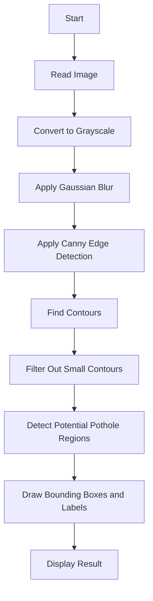

# Pothole Detection using OpenCV-Python (Non-AI)

<p align="center">
<a href="https://www.python.org/" target="_blank"></a>
<a href="https://opencv.org/" target="_blank"></a>
<a href="https://code.visualstudio.com/" target="_blank"></a>
</p>

<p align="center">
<a href="https://twitter.com/12dtan" target="_blank"></a>
<a href="https://fb.com/duytan.hh" target="_blank"></a>
<a href="https://t.me/duytan2003" target="_blank"></a>
<a href="https://www.linkedin.com/in/l%C3%AA-tr%E1%BA%A7n-duy-t%C3%A2n-81112a23a/" target="_blank"></a>
<a href="https://instagram/duytan.hh" target="_blank"></a>
</p>

## Overview

> **Description:** This project uses classic image processing techniques including edge detection and the Canny filter to detect potholes in road images and generate alerts for drivers.

<p align="center">
  
</p>

---

## 1. Block Diagram



## 2. Edge Detection Overview

Edge detection highlights boundaries in images where there are significant changes in color intensity or brightness. It plays a crucial role in:

- Object Detection  
- Shape Analysis  
- Object Tracking  
- Image Segmentation

### Common Edge Detection Techniques

**1. Canny Filter**  
Powerful algorithm involving smoothing, gradient calculation, thinning, and double thresholding.

**2. Gradient Operators (Sobel, Prewitt, Roberts)**  
Detect intensity changes in vertical/horizontal or diagonal directions.

**3. Laplacian / Laplacian of Gaussian (LoG)**  
Second-order derivative methods useful for detecting rapid intensity changes.

**4. Morphological Operations**  
Improve clarity of shapes using dilation, erosion, opening, and closing.

**5. Hough Transform**  
Useful for detecting lines or curves using a voting system.

**6. Watershed Algorithm**  
Segment overlapping or adjacent objects by treating image as topography.

---

## 3. Canny Edge Detection

### Step 1: Gaussian Blur  
Reduces image noise with a Gaussian kernel:

$$
G(x, y) = \frac{1}{2\pi\sigma^2} e^{-\frac{x^2 + y^2}{2\sigma^2}}
$$

### Step 2: Compute Gradient

$$
G = \sqrt{G_x^2 + G_y^2},\quad \theta = \arctan\left(\frac{G_y}{G_x}\right)
$$

### Step 3: Non-Maximum Suppression  
Thin edges by removing non-maximum gradient values.

### Step 4: Double Thresholding  
Separate strong and weak edges using high/low threshold values.

### Step 5: Edge Tracking by Hysteresis  
Link weak edges to strong edges to maintain edge continuity.

---

## 4. Sample Code

### Convert to Grayscale

```python
im = cv2.imread('611.jpg')
gray1 = cv2.cvtColor(im, cv2.COLOR_BGR2GRAY)
cv2.imwrite('graypothholeresult.jpg', gray1)
```

### Contour Detection

```python
imgray = cv2.cvtColor(im, cv2.COLOR_BGR2GRAY)
ret, thresh = cv2.threshold(imgray, 127, 255, 0)
contours2, _ = cv2.findContours(thresh, cv2.RETR_TREE, cv2.CHAIN_APPROX_SIMPLE)
out = cv2.drawContours(im.copy(), contours2, -1, (250, 250, 250), 1)
```

### Draw Bounding Boxes

```python
for c in contours:
    rect = cv2.boundingRect(c)
    if rect[2] < 100 or rect[3] < 100: continue
    x, y, w, h = rect
    cv2.rectangle(im, (x, y), (x + w, y + h), (0, 255, 0), 8)
    cv2.putText(im, 'Pothole Detected', (x + w + 40, y + h), 0, 2.0, (0, 255, 0))
```

### Check Convexity

```python
k = cv2.isContourConvex(cnt)
print(k)
```

### Blurring Methods

```python
blur = cv2.blur(im, (5, 5))
gblur = cv2.GaussianBlur(im, (5, 5), 0)
median = cv2.medianBlur(im, 5)
```

### Morphological Operations

```python
kernel = np.ones((5, 5), np.uint8)
erosion = cv2.erode(median, kernel, iterations=1)
dilation = cv2.dilate(erosion, kernel, iterations=5)
closing = cv2.morphologyEx(dilation, cv2.MORPH_CLOSE, kernel)
edges = cv2.Canny(dilation, 9, 220)
```

### Display Results with Matplotlib

```python
plt.subplot(332), plt.imshow(blur), plt.title('Blurred')
plt.subplot(333), plt.imshow(gblur), plt.title('Gaussian Blur')
plt.subplot(334), plt.imshow(median), plt.title('Median Blur')
plt.subplot(337), plt.imshow(im, cmap='gray'), plt.title('Dilated Image')
plt.subplot(338), plt.imshow(edges, cmap='gray'), plt.title('Edge Image')
plt.subplot(335), plt.imshow(erosion), plt.title('Erosion')
plt.subplot(336), plt.imshow(closing), plt.title('Closing')
plt.show()
```

---

## 5. Resources

### OpenCV Installation

Install with pip:

```bash
pip install opencv-python
```

- [OpenCV Official Site](https://opencv.org/)

### References

- **CSIR (2010)**. *Potholes: Technical Guide to Their Causes, Identification and Repair*.  
  [View PDF](http://www.csir.co.za/pothole_guides/docs/Pothole_CSIR_tech_guide.pdf)

- **OpenCV (2014)**. *The OpenCV Reference Manual Release 2.4.9.0*.  
  [View PDF](http://docs.opencv.org/opencv2refman.pdf)
